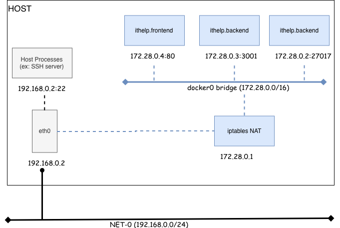
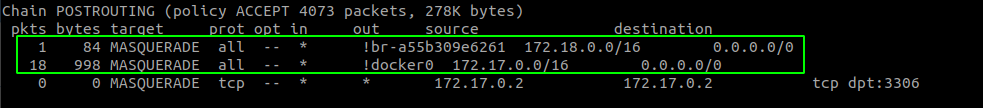
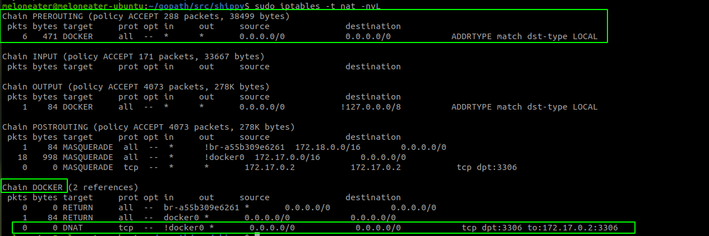
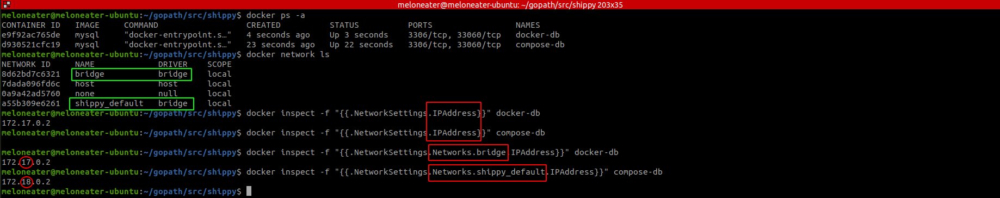
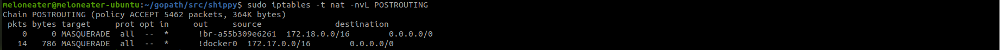
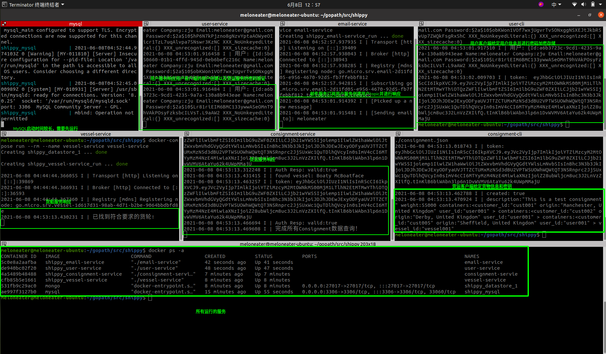
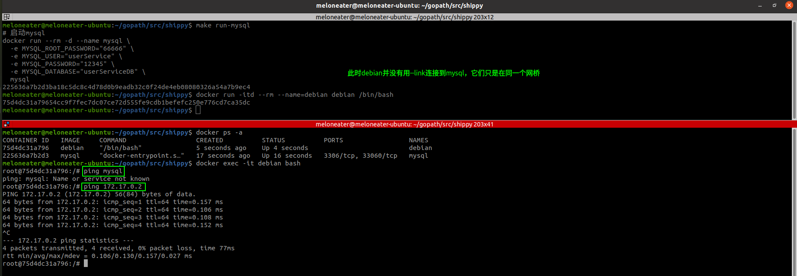
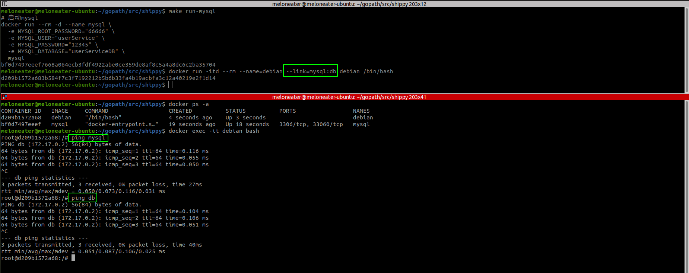
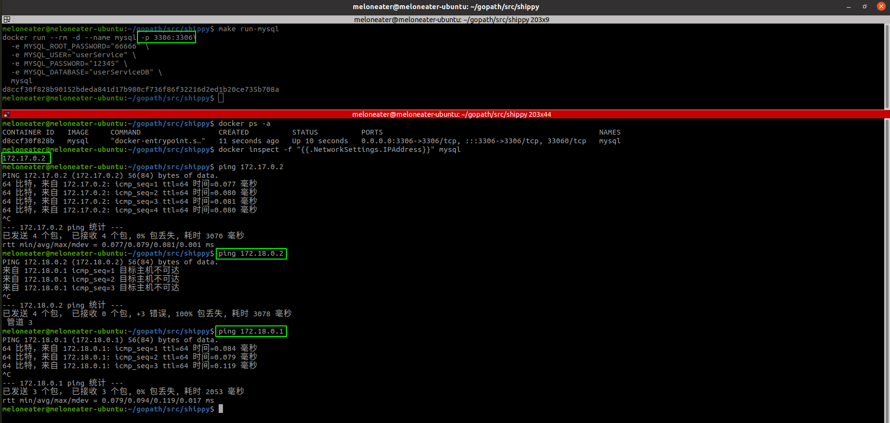
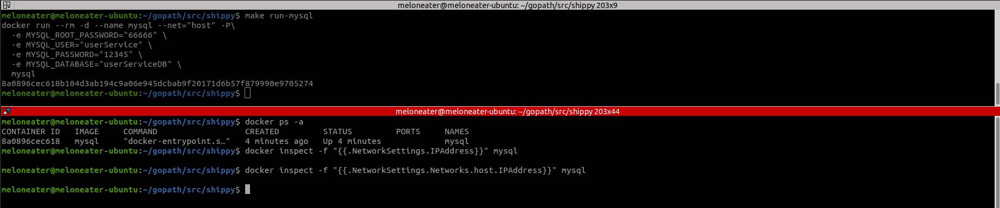

# docker网络结构与docker-compose细究

### 容器网络基本原理

### docker容器与外部访问实现

- **iptables网络路由**

  源地址发送数据--> {PREROUTING-->路由规则-->POSTROUTING} -->目的地址接收到数据

- **容器访问外部**

  容器源地址映射(SNAT)，通过iptables的源地址伪装操作。查看主机的nat表上的POSTROUTING链故则，负责包离开主机前改写源地址。

  因为建立docker0和docker-compose两个网桥，所以有两个链路

   

  

- **外部访问容器**

  将外部IP访问的包进行目标地址映射(DNAT)，将目标地址改为容器的IP地址。

  PREROUTING链负责包到达网络接口时将流量转到DOCKER链上，DOCKER链将所有不是从docker0进来的包进行DNAT

   

### docker和docker-compose创建的应用在不同的网桥

- **简单描述**：docker-db和compose-db分别是直接docker run和用docker-compose run出来的两个容器
- **网桥**：从docker network结果中可以看到，在原始docker0网桥(172.17.0.0/16)的基础上，还产生了另一个网桥shippy_default(172.18.0.0/16)【如绿色框所示】
- **IPAddress**：用docker直接run出来的容器外层IPAddress是和网桥内的一样的；但是docker-compose run出来的容器外层IPAddress是空的【如红色框所示】

最终将所有服务都使用docker-compose启动，无bug运行结果：

### docker容器互联

- 如果不使用--link连接，那么不能用容器名进行连接

  

- 现在用了--link，就可以直接用容器名或者别名互联

  

### docker主机访问

- **端口映射方法**：将容器的3306端口映射到主机IP的3306端口，这样可以直接从主机ping通实现外部访问

- **直接和主机共用网络**：--net="host"，此模式不能指定端口，除非用-P随机端口，但是似乎被忽略了，因为查询时候并没有看到端口号；不是很推荐使用

  

### docker-compose其他坑

- 如果要映射docker-compose.yaml中的ports，run的时候加上：--service-ports
- 如果要使用docker-compose.yaml中的container_name，那么应该用up启动容器而不是run；如果要用run，那就加上--name参数